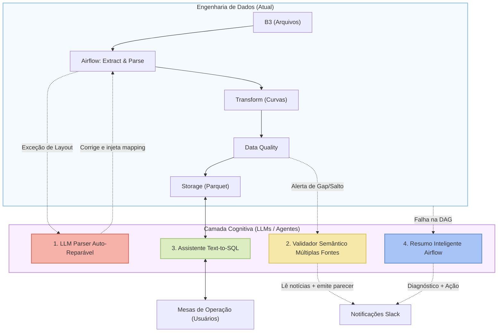
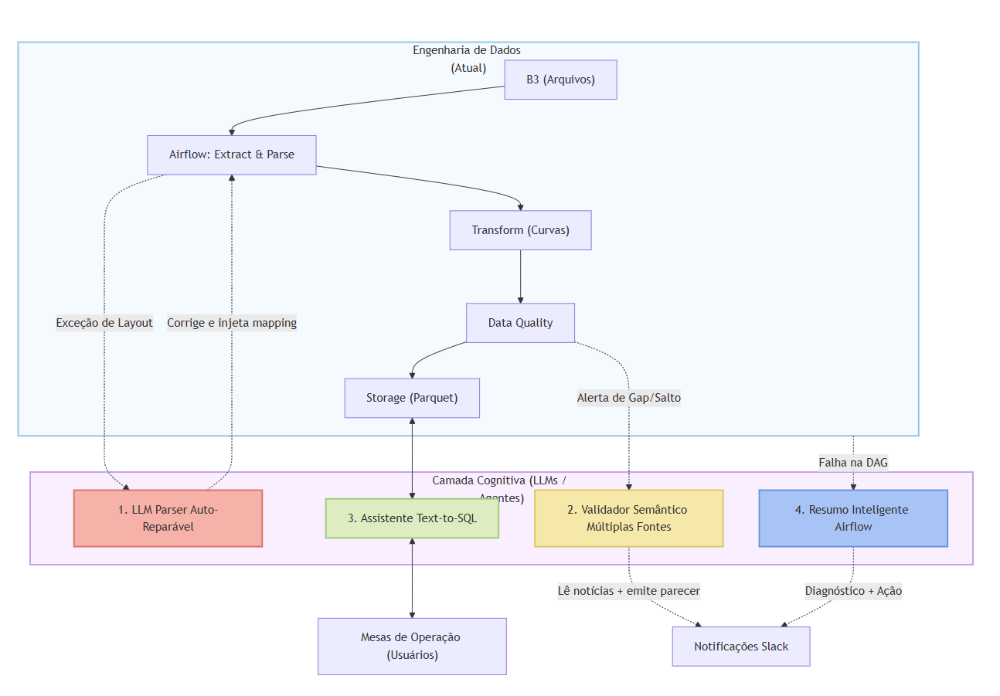

# Documentação Técnica - Pipeline de Taxas Referenciais B3

## 1. Arquitetura da Solução

O pipeline segue uma arquitetura ETL (Extract, Transform, Load) modular:

```
┌───────────────────────────────────────────────────────────────┐
│                       Apache Airflow                         │
│                                                              │
│  ┌────────┐   ┌─────────┐   ┌───────────┐   ┌───────────┐   │
│  │ Check  │──>│ Extract │──>│   Parse   │──>│ Transform │   │
│  │ BizDay │   │ (B3 DL) │   │ (Layout)  │   │ (Curvas)  │   │
│  └────────┘   └─────────┘   └───────────┘   └─────┬─────┘   │
│                                                    │         │
│                                              ┌─────┴─────┐   │
│                              ┌───────────┐   │ Validate  │   │
│                              │   Store   │<──│ (Quality) │   │
│                              │  (Parquet)│   └───────────┘   │
│                              └───────────┘                   │
└───────────────────────────────────────────────────────────────┘
```

### Fluxo de dados

1. **Check Business Day**: Verifica se a data é dia útil usando calendário de feriados brasileiros
2. **Extract**: Baixa o arquivo `TS{YYMMDD}.ex_` da B3 e descomprime
3. **Parse**: Interpreta o arquivo posicional/CSV com detecção automática de formato
4. **Transform**: Separa por curva (DI x Pré, Ajuste Pré, DI x TR) e calcula campos derivados
5. **Validate**: Verifica completude, continuidade, atualização e consistência
6. **Store**: Persiste em formato Parquet particionado por curva e data

### Componentes

| Módulo | Responsabilidade |
|--------|-----------------|
| `utils.py` | Calendário, formatação de datas, URLs |
| `extractor.py` | Download com retry e descompressão multi-formato |
| `parser.py` | Parsing adaptativo (CSV `;`/`\t`/`\|`, posicional) |
| `transformer.py` | Filtragem por curva, cálculo de fator de desconto e taxa 360 |
| `validator.py` | 4 pilares de qualidade de dados |
| `storage.py` | Persistência Parquet/CSV com upsert idempotente |

---

## 2. Modelagem de Dados

### Tabelas

| Tabela | Descrição | Granularidade | Publicada |
|--------|-----------|---------------|-----------|
| `raw/` | Arquivos brutos da B3 | 1 arquivo por dia | Não |
| `processed/` | Dados por curva particionados | 1 registro por (data, curva, vértice) | Não |
| `published/` | Visão consolidada por curva | 1 registro por (data, curva, vértice) | **Sim** |

### Schema da tabela publicada (`taxas_referenciais`)

| Coluna | Tipo | Descrição |
|--------|------|-----------|
| `data_referencia` | `DATE` | Data-base da curva |
| `curva_nome` | `VARCHAR` | Nome da curva (DI x Pré, Ajuste Pré, DI x TR) |
| `curva_id` | `VARCHAR` | Código da curva (PRE, APR, TR) |
| `dias_corridos` | `INT` | Prazo em dias corridos |
| `dias_uteis` | `INT` | Prazo em dias úteis |
| `taxa_252` | `DECIMAL(12,8)` | Taxa ao ano base 252 |
| `taxa_360` | `DECIMAL(12,8)` | Taxa ao ano base 360 (calculada) |
| `fator_desconto` | `DECIMAL(18,12)` | Fator de desconto (calculado) |
| `data_processamento` | `TIMESTAMP` | Timestamp do processamento |

### Estrutura de diretórios

```
data/
├── raw/                            # Arquivos brutos
│   └── 2026/03/06/
│       ├── TS260306.ex_           # Arquivo comprimido original
│       └── TS260306.txt           # Arquivo texto extraído
├── processed/                      # Dados particionados por curva/data
│   ├── curva=di_x_pré/
│   │   └── ano=2026/mes=03/
│   │       └── 2026-03-06.parquet
│   ├── curva=ajuste_pré/
│   │   └── ano=2026/mes=03/
│   │       └── 2026-03-06.parquet
│   └── curva=di_x_tr/
│       └── ano=2026/mes=03/
│           └── 2026-03-06.parquet
└── published/                      # Visão consolidada para consumo
    ├── taxas_di_x_pré.parquet
    ├── taxas_ajuste_pré.parquet
    └── taxas_di_x_tr.parquet
```

---

## 3. Estratégia de Backfill e Estimativa de Custo

### Estratégia

O backfill é executado através de uma DAG dedicada (`backfill_taxas_referenciais_b3`) com trigger manual:

- **Gap Detection**: Compara datas existentes com dias úteis esperados, processa apenas datas faltantes
- **Batching**: Processa datas sequencialmente com delay configurável entre requisições (padrão: 3s)
- **Idempotência**: Cada execução pode ser repetida sem duplicar dados (upsert no storage)
- **Resiliência**: Erros individuais não interrompem o processamento; registrados e reportados no final

### Parâmetros configuráveis

```json
{
  "start_date": "2016-01-01",
  "end_date": "2026-03-10",
  "batch_size": 10,
  "delay_seconds": 3
}
```

### Estimativa de Custo (AWS Glue)

| Parâmetro | Valor |
|-----------|-------|
| Dias úteis em 10 anos | ~2.600 |
| Tempo por dia (download + parse + transform) | ~5 segundos |
| Tempo total de processamento | ~3,6 horas |
| DPUs necessários | 2 (mínimo) |
| Custo por DPU-hora | US$ 0,44 |
| **Custo total estimado** | **~US$ 3,17** |

> **Nota**: O gargalo é o download sequencial da B3 (delay de 3s entre requests), não o processamento. O custo de computação é mínimo. É possível reduzir o delay para 1-2s, o que reduziria o tempo total mas aumenta o risco de bloqueio pela B3.

---

## 4. Mecanismos de Garantia de Qualidade

### 4 Pilares de Validação

| Pilar | Verificação | Severidade |
|-------|-------------|------------|
| **Completude** | Todas as 3 curvas presentes; mín. de vértices por curva | ERROR/WARNING |
| **Continuidade** | Sem gaps no histórico de dias úteis | WARNING |
| **Atualização** | Data de referência = data esperada | ERROR |
| **Consistência** | Mesma data-base entre curvas; taxas em faixa razoável | WARNING |

### Limites

- DI x Pré: mínimo 10 vértices (normalmente tem 30+)
- Ajuste Pré: mínimo 5 vértices
- DI x TR: mínimo 5 vértices
- Taxas: entre -5% e 100% a.a. (faixa razoável para o mercado brasileiro)

### Comportamento por tipo de execução

- **Diário**: Validação estrita — falha a task se ERROR detectado
- **Backfill**: Validação leniente — loga avisos mas não interrompe o processamento

---

## 5. Trade-offs e Decisões de Design

### 1. Formato Parquet vs CSV
**Decisão**: Parquet como formato padrão, CSV como alternativa configurável.
**Razão**: Parquet oferece compressão ~5x melhor, leitura colunar eficiente e tipagem de dados. CSV mantido como opção para depuração e integração com ferramentas legadas.

### 2. Armazenamento local vs S3
**Decisão**: Suporte a ambos via configuração por variáveis de ambiente.
**Razão**: Desenvolvimento local com filesystem; produção com S3 para durabilidade e integração com AWS ecosystem.

### 3. XCom para passagem de dados entre tasks
**Decisão**: Serialização JSON via XCom (Airflow).
**Razão**: Simplicidade e compatibilidade com Airflow. Para grandes volumes, seria necessário migrar para passagem via arquivo intermediário, mas os dados de um dia são pequenos (~50KB por curva).

### 4. Parser multi-formato
**Decisão**: Detecção automática de formato do arquivo (CSV `;`, `\t`, `|`, posicional).
**Razão**: O formato dos arquivos da B3 mudou ao longo dos anos (pelo menos 3 layouts diferentes registrados). O parser adaptativo garante compatibilidade com o backfill de 10 anos.

### 5. Download sequencial com delay
**Decisão**: Download um-a-um com delay de 3s no backfill.
**Razão**: Evita bloqueio/throttling pela B3. O paralelismo não reduziria o tempo total já que o bottleneck é o rate limit da B3, e aumentaria o risco de ban.

### 6. Calendário de feriados
**Decisão**: Biblioteca `holidays` do Python para feriados brasileiros.
**Razão**: Cobertura razoável de feriados nacionais e estaduais. Pode haver discrepâncias menores com o calendário ANBIMA oficial, tratadas via validação de continuidade (gap detection).

---

## 6. Visão Futura: Integração com LLMs e Agentes de IA

Para elevar a resiliência e a utilidade do pipeline, os seguintes casos de uso envolvendo Inteligência Artificial (LLMs) estão mapeados como próximos passos:





1. **Resolução Dinâmica de Layouts (Self-Healing Parser)**
   - **Problema:** A B3 altera o layout dos arquivos historicamente (posicional, CSV com `;`, tabs, etc.).
   - **Solução IA:** Em caso de falha de parsing, o arquivo bruto é enviado a um LLM que identifica o novo padrão e ajusta dinamicamente a lógica de extração sem quebrar a DAG.

2. **Análise Semântica de Qualidade de Dados (Validator 2.0)**
   - **Problema:** Gaps ou variações bruscas de taxas em momentos de crise geram falsos-positivos nos alertas.
   - **Solução IA:** A interceptação do alerta pelo LLM analisa as notícias do dia e emite um laudo semântico (ex: "Salto na taxa devido à eleição, comportamento esperado"), evitando ruído operacional.

3. **Consultas em Linguagem Natural (Text-to-SQL)**
   - **Problema:** Mesas de operação precisam cruzar safras de crédito rapidamente com o banco histórico.
   - **Solução IA:** Um chatbot integrado à base `taxas_referenciais` que traduz perguntas em linguagem natural ("Qual o fator de desconto da DIxPré em 2018?") para queries analíticas, com plotagem de gráficos automática.

4. **Resumo Inteligente de Alertas do Airflow**
   - **Problema:** Logs de erro do Airflow são extensos e difíceis de interpretar rapidamente.
   - **Solução IA:** Um Webhook com LLM resume o stacktrace e envia no Slack uma mensagem acionável (ex: "Falha por bloqueio de IP da B3. Sugestão: aumentar o delay do backoff").

5. **Data Catalog Automatizado**
   - **Problema:** Documentação de dados fica defasada com a evolução do projeto.
   - **Solução IA:** Agentes em CI/CD analisam mudanças no código (`transformer.py`) e atualizam automaticamente a documentação técnica (incluindo este markdown) quando novas curvas ou colunas são adicionadas.
